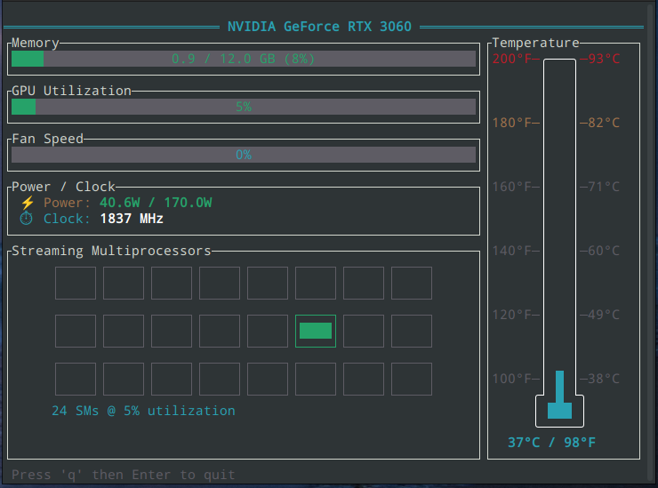

# gpu-view

A real-time terminal dashboard for NVIDIA GPU monitoring, built in Rust.



## Features

- **Memory usage** — Bar graph showing used/total VRAM
- **GPU utilization** — Real-time percentage with color coding
- **Temperature** — Thermometer visualization with Fahrenheit/Celsius scales and danger zone indicators
- **Fan speed** — Current fan speed percentage
- **Power draw** — Wattage consumption vs power limit
- **Clock speed** — Current GPU clock in MHz
- **Streaming Multiprocessors** — Visual grid showing GPU parallel activity

Updates every second. Press `q` then `Enter` to quit.

## Requirements

- Linux with NVIDIA GPU
- NVIDIA drivers installed (the `nvidia-smi` command should work)
- Rust toolchain (for building from source)

## Installation

### From Source

1. **Install Rust** (if not already installed):
   ```bash
   curl --proto '=https' --tlsv1.2 -sSf https://sh.rustup.rs | sh
   ```

2. **Clone the repository**:
   ```bash
   git clone https://github.com/ztblick/gpu-view.git
   cd gpu-view
   ```

3. **Build the release binary**:
   ```bash
   cargo build --release
   ```

4. **Install to your PATH**:
   ```bash
   # System-wide (requires sudo)
   sudo cp target/release/gpu_dashboard /usr/local/bin/gpu-view

   # Or user-local (no sudo required)
   mkdir -p ~/.local/bin
   cp target/release/gpu_dashboard ~/.local/bin/gpu-view
   ```

   If using `~/.local/bin`, make sure it's in your PATH by adding this to your `~/.bashrc`:
   ```bash
   export PATH="$HOME/.local/bin:$PATH"
   ```

5. **Run it**:
   ```bash
   gpu-view
   ```

### Using Cargo Install

Alternatively, you can install directly with cargo:

```bash
git clone https://github.com/ztblick/gpu-view.git
cd gpu-view
cargo install --path .
```

This installs the binary as `gpu_dashboard` in `~/.cargo/bin/`.

## Usage

Simply run:

```bash
gpu-view
```

The dashboard will display real-time GPU statistics. Press `q` followed by `Enter` to exit.

## Troubleshooting

### "Could not initialize NVIDIA GPU monitoring"

This error appears if:
- No NVIDIA GPU is detected
- NVIDIA drivers are not installed
- The NVML library is not available

**Solution**: Ensure your NVIDIA drivers are properly installed:
```bash
nvidia-smi
```

If this command doesn't work, install the NVIDIA drivers for your distribution.

## Dependencies

This project uses:
- [ratatui](https://github.com/ratatui-org/ratatui) — Terminal UI framework
- [crossterm](https://github.com/crossterm-rs/crossterm) — Cross-platform terminal handling
- [nvml-wrapper](https://github.com/Cldfire/nvml-wrapper) — NVIDIA Management Library bindings

## License

MIT
